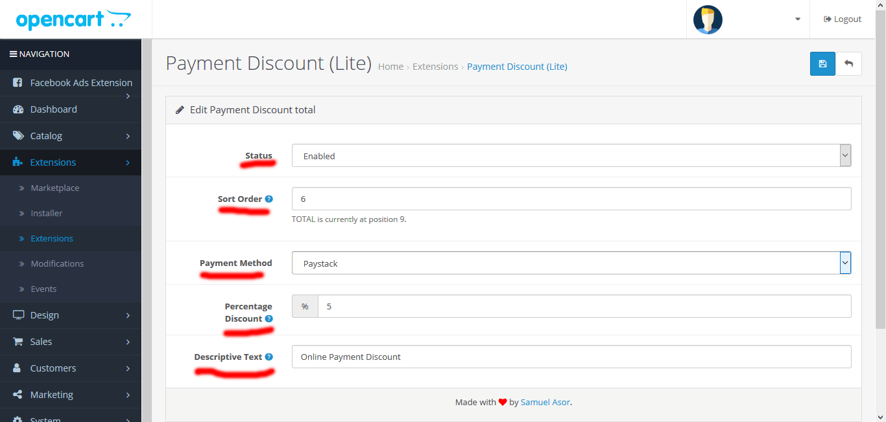
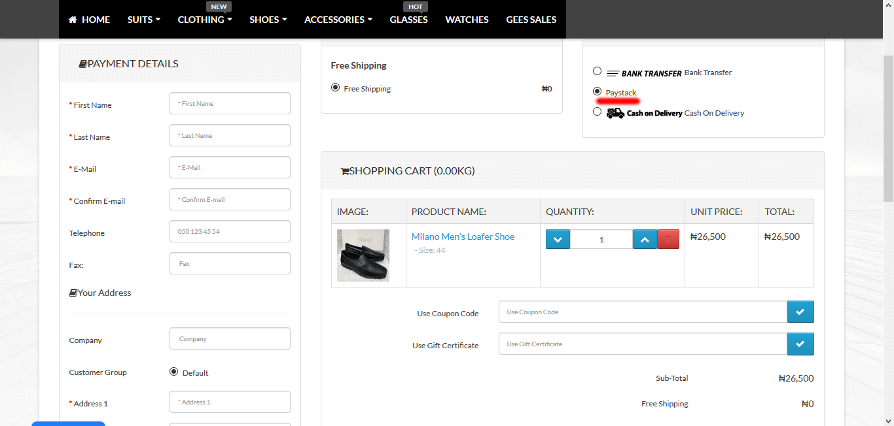
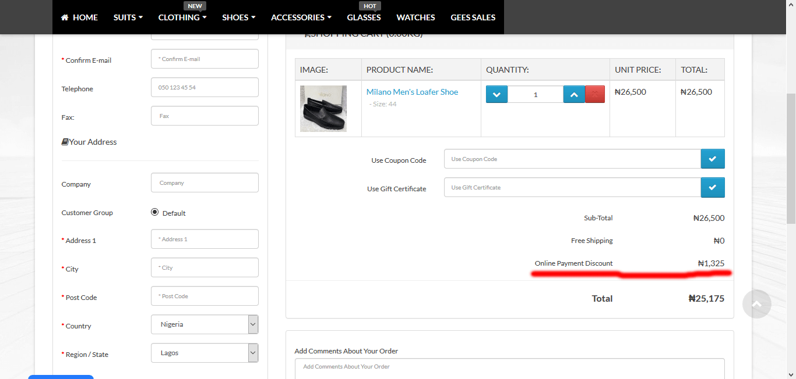

# Payment Discount Extension for Opencart 3.x

This extension can be used to apply a certain discount to customers who choose to pay for your products using your specified payment method(s).

Let's say for example, you have provided 3 *(Bank Deposit, Pay on Delivery and Online Payment)* payment options for your customers, and your want to encourage your customers to pay online, you can simple add a discount for payments made via the online payment option.

### Installation Instruction
1. Clone or download this repo.
2. Upload the files inside the `upload` folder using __FTP__ or any other means you know.
3. Go to your extensions.
4. Filter the extension and choose "Order Total".
5. Scroll down and `install` the __Payment Discount (Lite)__ extension.
6. Edit and choose the payment option to enable this discount.
7. Set the percentage discount.
8. Save.
9. And that's it!!!

### Screenshots

If you have any questions or want to say "hi", [Shoot me an email!](mailto:sammyskills@gmail.com)

__PS:__ This plugin is also available in the Opencart Extensions Marketplace. You can find it [here](https://www.opencart.com/index.php?route=marketplace/extension/info&extension_id=36715&filter_category_id=6&filter_license=0).